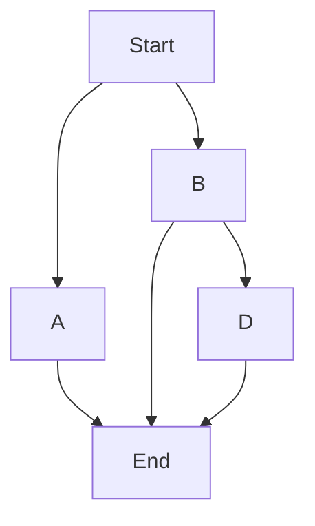

148-winter-2025-final-project-team-12

 
 # MapsAI: Search and Rescue Robot
 
 
 
 ### ECE/MAE 148 Final Project
 #### Team 12 Winter 2025
 
 
 

## Team Members
<ins>**M**</ins>atthew Tan |
 *ECE: Computer Engineering* 

<ins>**A**</ins>licia Baker |
 *MAE: Mechanical Engineering: Controls & Robotics*

<ins>**P**</ins>ranav Sakhuja |
 *MAE: Mechanical Engineering: Controls & Robotics* 
 
<ins>**S**</ins>idharth Mundra |
 *CSE: Computer Science*

## Abstract
Our idea was to create a robot that can successfully complete a rescue mission through the use of SLAM and object detection. The robot drives around, mapping a room using LiDAR as it goes. While it drives, its camera searches for a human. Once the human is detected, the robot car will use the A* shortest path algorithm to locate the room's nearest exit.

The robot utilizes the ROS2 topics for sensor fusion along with LiDAR for SLAM (Simultaneous Localization and Mapping). We also have Python scripts for real-time object detection on the OAK-D Lite camera, for implementing "follow the gap" navigation for object avoidance, and to manage the robot's movement.

## Goals
**Our Minimum Viable Product (MVP)**
- Use OpenCV plus YOLO for camera vision to identify a human
- Use SLAM on LiDAR to map that room
- Pin the location of the human on the room map

**Nice-to-Haves**
- Run a script to find the shortest path out of the room

## What We Achieved
- Camera Vision Identifying Human

https://github.com/user-attachments/assets/e16ffcdf-1032-4d38-8db6-27d32a3e3822

- Room Map

https://github.com/user-attachments/assets/1549cafd-7ef7-4579-bd22-0805c3ce8e3a

## Challenges
- We originally wanted to use [VSLAM](https://www.automate.org/vision/blogs/what-is-visual-slam-technology-and-what-is-it-used-for) running on the OAK-D Pro processor from the TA car so that we could have a 3D point cloud map for precise mapping, but we ran into a plethora of compatability issues and ultimately had to give up on that idea after a week of effort.
- The initial idea of running both VSLAM and the object-detection script on the OAK-D Pro camera proved to have problems due to multiple accesses of the same port. We tried to resolve this issue by posting the camera feed to a server and having the scripts pull the data from the server, but this also did not work for us.
- We tried using the SICK TiM LiDAR for the original implementation of the SLAM idea, but ran into issues and was forced to pivot to the less powerful LD06 LiDAR, which was both simpler to use and had much more supporting documentation that was provided by the class staff.
- Overall, integration between the different software components and communication between the follow the gap, object-detection, and lidar scanning nodes proved to be very challenging. Each of us spent countless hours trying to work through implementation, but in the end the plethora of dependency issues and stubborn software bugs really bogged down our progress.

Here is a video of the VSLAM running on a lab pc! Even though we didn't end up using it, we still think it's pretty cool: 

https://github.com/user-attachments/assets/e75f8c8a-4a3a-4a46-8c71-9e1c38dce97a

## Future Goals
- Place Human on Map
- Once the human is located, find the shortest path out of the room using the A* shorest path algorithm

A*: Chooses the shortest distance between two points repeatedly. Thus, choosing B over A and then D over End.

## Software
### Architectural Overview
This project utilized the Hector SLAM with the Robocar platform, Triton-AI's implementation of F1Tenth's Follow the Gap algorithm, and YOLOv5 for object detection. We also used [djnighti/ucsd_robocar container](https://hub.docker.com/r/djnighti/ucsd_robocar), with significant adaptations for integration between our ROS2 project nodes, including mapping, object-detection, and movement.

### SLAM with ROS1-Bridge-ROS2 and Hector+Robocar
For the [SLAM (Simultaneous Localization and Mapping)](https://en.wikipedia.org/wiki/Simultaneous_localization_and_mapping) implementation, our team used the ROS1-Bridge-ROS2 to ensure seamless communication between ROS1 and ROS2 components. This setup was crucial as it allowed us to leverage existing ROS1 packages within the newer ROS2 framework. We chose the Hector SLAM algorithm for our project due to its robust performance in indoor environments with limited computational resources. Hector SLAM, combined with the Robocar platform, allowed us to generate accurate and reliable maps of the environment in real-time. As the robot navigated, the SLAM system continuously updated its map and localized the robot within that map. One of the challenges we faced was ensuring that the data from the LiDAR, which is inherently noisy, was processed effectively. The LiDAR output wasn’t always clean, leading to occasional inaccuracies in the map generation. To overcome this, we fine-tuned the filter parameters in Hector SLAM to better handle the noisy LiDAR data, resulting in improved map consistency and a more accurate localization of the robot within the environment.

### F1T-FTG Algorithm
We integrated [Triton-AI's implementation](https://github.com/Triton-AI/follow-the-gap) the [F1-Tenth “Follow the Gap” (F1T-FTG) algorithm](https://f1tenth-coursekit.readthedocs.io/en/stable/lectures/ModuleB/lecture06.html) to enhance the robot's navigation capabilities by providing a heading based on LiDAR data. This algorithm works by detecting a "gap" in the surrounding environment and steering the robot towards it, effectively allowing it to navigate through the room autonomously. The algorithm was coupled with the SLAM system, which generated a real-time map of the room, and used the LiDAR inputs to guide the robot’s movement. The main challenge we encountered during this integration was that the LiDAR data was not always clean, which led to inconsistencies in the heading commands generated by the F1T-FTG algorithm. These inconsistencies caused the robot to make unexpected or erratic movements. To mitigate this, we implemented a post-processing filter on the LiDAR data to smooth out noise and reduce the impact of erroneous readings, improving the reliability of the heading commands and making the robot’s movement more stable.

### Object Detection with YOLO v5 and ROS Integration
For object detection, we utilized a pre-trained [YOLOv5](https://github.com/ultralytics/yolov5) model to detect objects in the robot's environment, focusing specifically on detecting humans. We filtered the model to detect only the "person" class (class ID 0 in the COCO dataset), which allowed us to focus on human presence within the environment. The YOLO model was integrated with our ROS system, where the binary output (1 for person detected, 0 for not detected) was published to a ROS topic for further processing. One of the key challenges was ensuring that the model was running efficiently on our robot’s hardware, as object detection can be computationally intensive. To address this, we used a lightweight version of YOLOv5 and optimized the model for real-time performance. Additionally, we faced challenges with false positives and missed detections, especially in cluttered environments. To mitigate this, we fine-tuned the model's confidence thresholds and used additional post-processing techniques to filter out false detections, enhancing the accuracy of the detection system. The successful integration of YOLOv5 allowed the robot to effectively identify and respond to human presence, adding a layer of interaction to the navigation system.

## Acknowledgements
Thank you to Professor Jack Silberman and our incredible TAs Alexander Haken and Winston Chou for an amazing Winter 2025 class!

## Contact
**M**atthew Tan |
mztan@ucsd.edu | [LinkedIn](https://www.linkedin.com/in/matthewztan)

**A**licia Baker |
arbaker@ucsd.edu | [LinkedIn](https://www.linkedin.com/in/alicia-r-baker)

**P**ranav Sakhuja |
psakhuja@ucsd.edu | [LinkedIn](https://www.linkedin.com/in/pranavsakhuja)

 
**S**iddharth Mundra |
smundra@ucsd.edu
