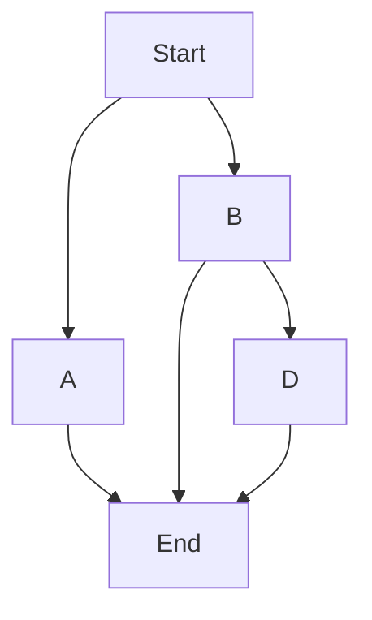

148-winter-2025-final-project-team-12

 
 # MapsAI: Search and Rescue Robot
 
 
 
 ### ECE/MAE 148 Final Project
 #### Team 12 Winter 2025
 
 
 

## Team Members

<ins>**M**</ins>atthew Tan |
 *ECE: Computer Engineering* 

<ins>**A**</ins>licia Baker |
 *MAE: Mechanical Engineering: Controls & Robotics*

<ins>**P**</ins>ranav Sakhuja |
 *MAE: Mechanical Engineering: Controls & Robotics* 
 
<ins>**S**</ins>idharth Mundra |
 *CSE: Computer Science*

## Abstract
Our idea was to create a robot that can successfully complete a rescue mission through the use of SLAM and object detection. The robot drives around, mapping a room using LiDAR as it goes. While it drives, its camera searches for a human. Once the human is detected, the robot car will use the A* shortest path algorithm to locate the room's nearest exit.

The robot utilizes the ROS2 topics for sensor fusion along with LiDAR for SLAM (Simultaneous Localization and Mapping). We also have Python scripts for real-time object detection on the OAK-D Lite camera, for implementing "follow the gap" navigation for object avoidance, and to manage the robot's movement.

## Goals
**Our Minimum Viable Product (MVP)**
- Use OpenCV plus YOLO for camera vision to identify a human
- Use SLAM on LiDAR to map that room
- Pin the location of the human on the room map

**Nice-to-Haves**
- Run a script to find the shortest path out of the room

## What We Achieved
- Camera Vision Identifying Human

https://github.com/user-attachments/assets/e16ffcdf-1032-4d38-8db6-27d32a3e3822

- Room Map

https://github.com/user-attachments/assets/1549cafd-7ef7-4579-bd22-0805c3ce8e3a

## Challenges
- We originally wanted to use VSLAM running on the OAK-D Pro processor from the TA car so that we could have a 3D point cloud map for precise mapping, but we ran into a plethora of compatability issues and ultimately had to give up on that idea after a week of effort.
- The initial idea of running both VSLAM and the object-detection script on the OAK-D Pro camera proved to have problems due to multiple accesses of the same port. We tried to resolve this issue by posting the camera feed to a server and having the scripts pull the data from the server, but this also did not work for us.
- We tried using the SICK TiM LiDAR for the original implementation of the SLAM idea, but ran into issues and was forced to pivot to the less powerful LD06 LiDAR, which was both simpler to use and had much more supporting documentation that was provided by the class staff.
- Overall, integration between the different software components and communication between the follow the gap, object-detection, and lidar scanning nodes proved to be very challenging. Each of us spent countless hours trying to work through implementation, but in the end the plethora of dependency issues and stubborn software bugs really bogged down our progress.

Here is a video of the VSLAM running on a lab pc! Even though we didn't end up using it, we still think it's pretty cool: 

https://github.com/user-attachments/assets/e75f8c8a-4a3a-4a46-8c71-9e1c38dce97a

## Future Goals
- Place Human on Map
- Once the human is located, find the shortest path out of the room using the A* shorest path algorithm

A*: Chooses the shortest distance between two points repeatedly. Thus, choosing B over A and then D over End.

## Contact

**M**atthew Tan |
mztan@ucsd.edu | [LinkedIn](https://www.linkedin.com/in/matthewztan)

**A**licia Baker |
arbaker@ucsd.edu | [LinkedIn](https://www.linkedin.com/in/alicia-r-baker)

**P**ranav Sakhuja |
psakhuja@ucsd.edu | [LinkedIn](https://www.linkedin.com/in/pranavsakhuja)

 
**S**idharth Mundra |
smundra@ucsd.edu
